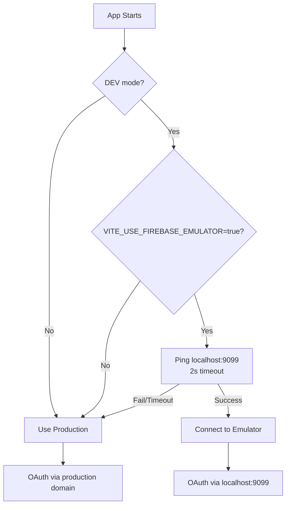

# Firebase OAuth Emulator - Quick Reference

## 🚀 Quick Start

### Option 1: With Emulator (Recommended for Local Development)
```bash
# Terminal 1: Start Firebase emulators
firebase emulators:start

# Terminal 2: Start dev server
npm run dev
```
**Result**: OAuth uses `http://localhost:9099` ✅

### Option 2: Without Emulator (Production Testing)
```bash
# Just start dev server (no emulator)
npm run dev
```
**Result**: OAuth uses production domain from `.env` ✅

## 🔧 Configuration

### Enable Automatic Detection
```env
VITE_USE_FIREBASE_EMULATOR=true
```

### Force Production Firebase
```env
VITE_USE_FIREBASE_EMULATOR=false
```

## 📊 How It Works



## 🎯 What Changed

### Before (❌ Problem)
```javascript
// Hard-coded emulator connection
if (import.meta.env.DEV && import.meta.env.VITE_USE_FIREBASE_EMULATOR === 'true') {
  connectAuthEmulator(auth, 'http://localhost:9099');
}
```
- If emulator stops → "Site can't be reached" 💥
- No fallback to production
- Build-time check only

### After (✅ Solution)
```javascript
// Automatic detection with fallback
async function detectAndConnectEmulators() {
  try {
    // Check if emulator is actually running
    await fetch('http://localhost:9099', { timeout: 2000 });
    connectAuthEmulator(auth, 'http://localhost:9099');
    console.log('✅ Using emulators');
  } catch {
    console.log('🌐 Using production');
  }
}
```
- Runtime availability check
- 2-second timeout
- Graceful fallback to production

## 🐛 Troubleshooting

### Login shows "Site can't be reached"
**Cause**: Emulator was detected but then stopped  
**Fix**: Restart dev server (`npm run dev`)

### OAuth redirects to wrong domain
**Check console for**:
```
✅ Using emulators          → Should redirect to localhost:9099
🌐 Using production Firebase → Should redirect to your-app.firebaseapp.com
```

### Emulator data not persisting
```bash
# Export data
firebase emulators:export ./emulator-data

# Import on start
firebase emulators:start --import=./emulator-data --export-on-exit
```

## 📝 Console Messages Reference

| Message | Meaning |
|---------|---------|
| `🔧 Firebase Emulators detected` | Emulator found, connecting... |
| `✅ Successfully connected to Firebase Emulators` | Using emulator mode |
| `⏱️ Emulator detection timeout` | Emulator took too long, using production |
| `🌐 Emulators not detected` | No emulator found, using production |
| `🌐 Using production Firebase services` | Flag disabled or production build |

## ⚡ Pro Tips

### Tip 1: Force Production in Dev
```javascript
// In browser console
localStorage.setItem('forceProductionFirebase', 'true');
location.reload();
```

### Tip 2: Check Current Mode
```javascript
// In browser console
console.log('Auth Config:', auth.config);
// Look for emulator.url property
```

### Tip 3: Parallel Terminal Setup
```bash
# Install concurrently
npm install -D concurrently

# package.json script
"dev:full": "concurrently \"firebase emulators:start\" \"npm run dev\""
```

### Tip 4: VS Code Launch Configuration
`.vscode/launch.json`:
```json
{
  "version": "0.2.0",
  "configurations": [
    {
      "name": "Dev with Emulators",
      "type": "chrome",
      "request": "launch",
      "url": "http://localhost:5173",
      "preLaunchTask": "start-emulators"
    }
  ]
}
```

## 🔒 Security Checklist

- [ ] `.env` added to `.gitignore`
- [ ] `serviceAccountKey.json` not committed
- [ ] Production builds never use emulator
- [ ] Authorized domains configured in Firebase Console
- [ ] OAuth consent screen configured in Google Cloud

## 📚 Related Files

- Configuration: [src/firebase/firebaseConfig.js](src/firebase/firebaseConfig.js)
- Full Guide: [FIREBASE_EMULATOR_SETUP.md](FIREBASE_EMULATOR_SETUP.md)
- Ports Config: [firebase.json](firebase.json)
- Environment: [.env.example](.env.example)

## 🆘 Need Help?

1. Check [FIREBASE_EMULATOR_SETUP.md](FIREBASE_EMULATOR_SETUP.md) for detailed explanation
2. View console logs for current mode
3. Verify `.env` configuration
4. Ensure emulator ports match `firebase.json`
